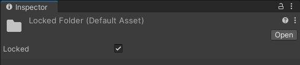

# LockableFolders
Unity version: 2020.3

Lockable Asset folders that prevent changes to their contents. The Editor script implementing this is `Assets/Editor/LockableFolders.cs`.

This can be useful to protect team workflows where adding Assets to specific folders has side-effects (e.g. an Addressables group with a folder) that can easily go unnoticed otherwise.

When a folder is locked, it stores a list of its children Assets in its [userData](https://docs.unity3d.com/ScriptReference/AssetImporter-userData.html) property. An [AssetPostprocessor](https://docs.unity3d.com/ScriptReference/AssetPostprocessor.html) monitors Asset operations and warns when a locked folder's contents are modified.

The sample adds a checkbox for folders in the Inspector to toggle between locked and unlocked states.

