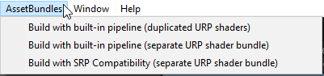
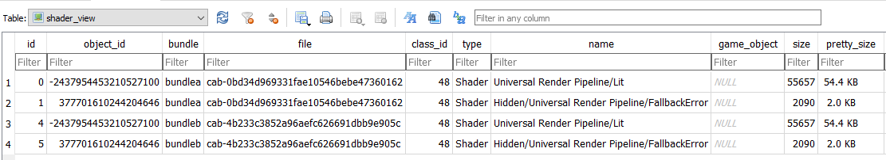
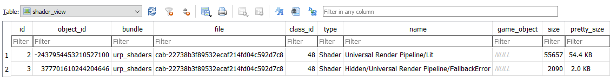

# URPShaderAssetBundles
Unity version: 2020.3

This sample shows how to create an AssetBundle with the shaders included in the Universal Render Pipeline (URP) package.

Unity's built-in support for AssetBundles does not fully integrate with assets located in packages. With Unity's built-in build pipeline, the association between an asset and its AssetBundle is stored in the asset's meta file. However, Unity packages are read-only so the meta file of a package asset can not be modified to specify an AssetBundle. There is therefore no way to directly assign a package asset to an AssetBundle using the Inspector. The concrete impact of this is that package assets (e.g. URP shaders) referenced from multiple AssetBundles (e.g. materials of different levels) are duplicated in all these AssetBundles.

The [Addressables](https://docs.unity3d.com/Manual/com.unity.addressables.html) package covers this use-case because it stores the association between assets and their AssetBundle in a separate file.

Another solution demonstrated in this sample is to programmatically add the URP shaders to a bundle and use the [BuildPipeline.BuildAssetBundles](https://docs.unity3d.com/ScriptReference/BuildPipeline.BuildAssetBundles.html) method taking an [AssetBundleBuild](https://docs.unity3d.com/ScriptReference/AssetBundleBuild.html) parameter. This works with both Unity's legacy built-in build pipeline and the [Scriptable Build Pipeline](https://docs.unity3d.com/Packages/com.unity.scriptablebuildpipeline@latest)

The sample is a very simple example with two materials using the `Universal Render Pipeline/Lit`. Each material is assigned to a separate AssetBundle. This menu triggers AssetBundle builds in `Editor/BundleBuilder.cs`:

The data for the screenshots below comes from the [AssetBundle Analyzer](https://github.com/faelenor/asset-bundle-analyzer).

The first AssetBundle build option gives this result with the `Lit` shader included in both bundles:

The other AssetBundle build options produce a separate URP shader bundle that avoids shader duplication:

