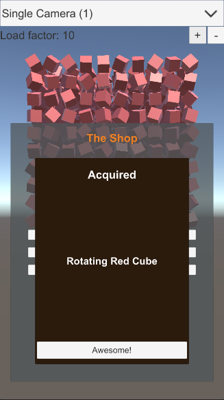
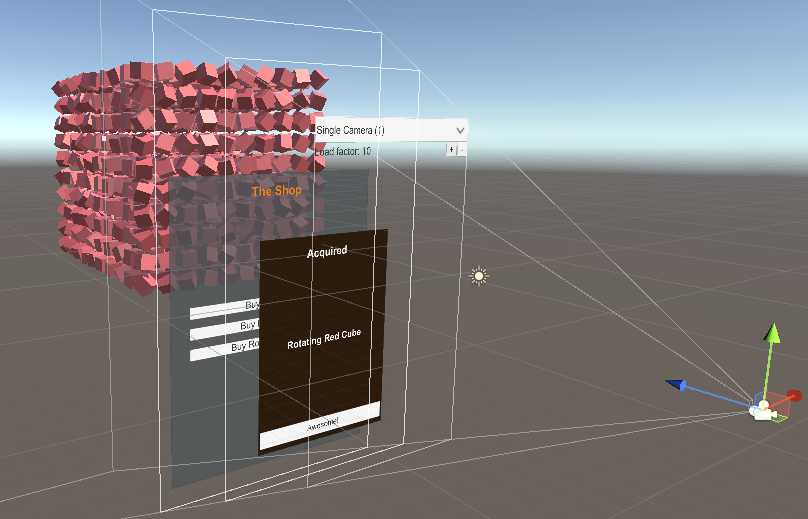

# CameraPerformance
Unity version: 2020.3

This is a performance benchmark project for measuring the impact of using multiple Cameras in Unity's Built-in Render Pipeline and the Universal Render Pipeline (URP).

From back to front, every scene has:
- A 3D grid of spinning cubes. Each slice is a 10x10 grid of cubes. The number of slices is adjustable and is the “load factor”.
- A single directional light source with soft shadows.
- 2 “game” UI canvases with a panel each to simulate two popups in a mobile game.
- A separate “overlay” UI canvas for controlling the test.

The projects have four scenes with different Camera configurations:
1. The optimal scene with only the Main Camera. The “game” UI canvases are set to “Screen Space - Overlay”.
2. The 2 “game” UI canvases are set to “Screen Space - Camera” and assigned to a second Camera. This is a relatively common Camera setup we’ve seen used in games.
3. The 2 “game” UI canvases are set to “Screen Space - Camera” and each is assigned to a separate Camera. This simulates a Camera setup where multiple Cameras are used to composite the UI.
4. This is the same as the third scene with an extra Camera with its culling mask set to “Nothing” so it doesn’t render anything.
