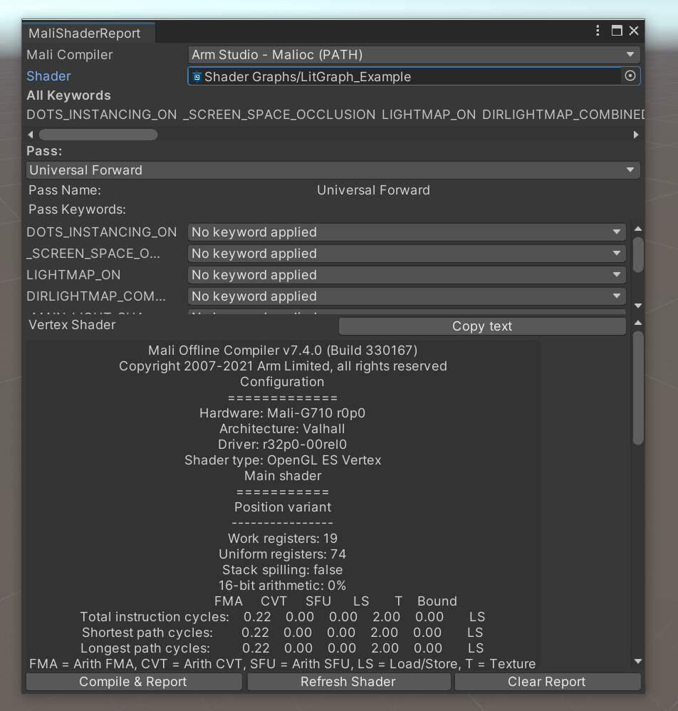
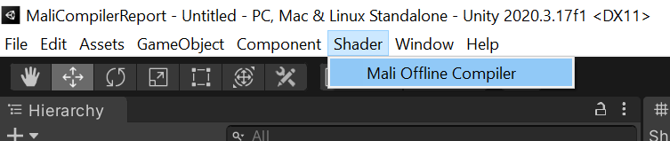
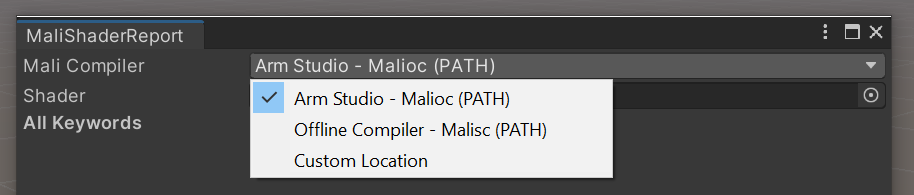
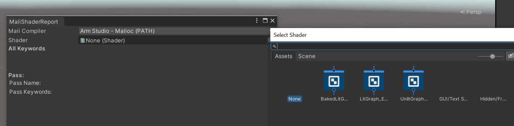
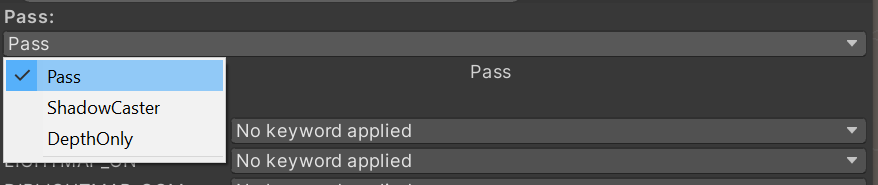
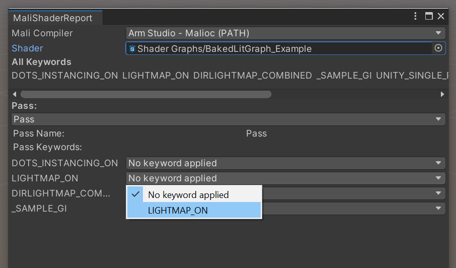

# Mali Compiler Report
Unity version: 2020.3.17+

A example tool that uses the new functionality in [ShaderData.Pass](https://docs.unity3d.com/ScriptReference/ShaderData.Pass.html) to compile shaders and then feeds this to the Mali Offline Compiler for a report.

To use this you will need to have either installed or downloaded the Mali Offline Compiler. You can either use the one that comes with the Arm Mobile Studio or a standalone copy.
- [ARM Mobile Studio](https://developer.arm.com/tools-and-software/graphics-and-gaming/arm-mobile-studio/components/mali-offline-compiler)
- [Mali Offline Compiler](https://developer.arm.com/tools-and-software/graphics-and-gaming/mali-offline-compiler/downloads)

## Instructions
- Select Shader->Mali Offline Compiler

- Select which compiler to use based on what you have installed

- Select a shader from the project

- Choose which pass you want to report on

- Choose any keywords you want enabled

- Hit Compile & Report to compile the shader to glsl and then run the offline tool on the result.

## Notes
- If you change the shader you will need to hit Refresh Shader for any changes to keywords to be reflected
- Clear Report will remove the report
- If you select custom you must enter the compiler location e.g. `C:\Program Files\Arm\Mali Developer Tools\Mali Offline Compiler v6.4.0\malisc.exe`
- Copy text will just copy the text to clipboard
- When a shader is compiled it created as a `.shader` file in the project `Temp` folder