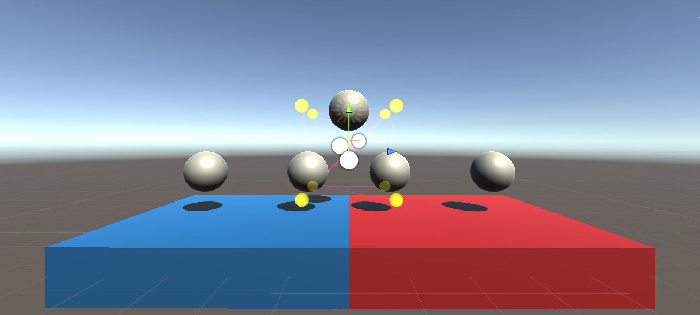
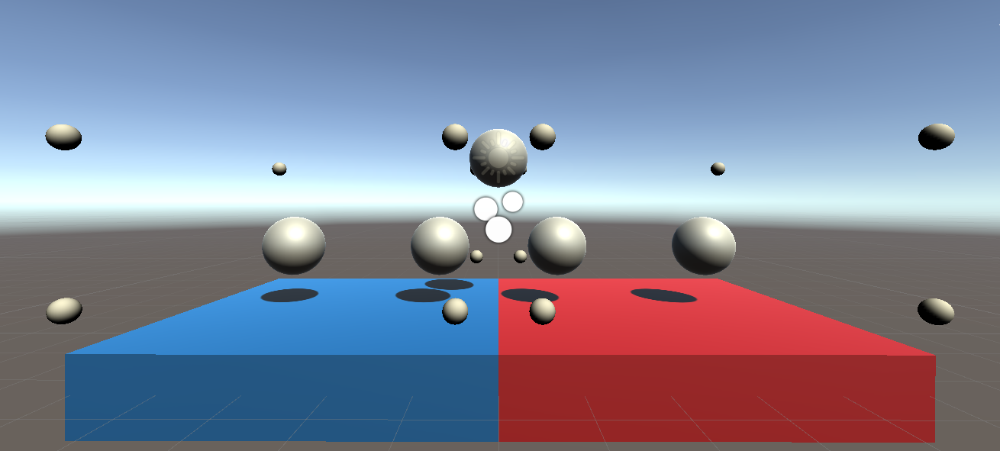
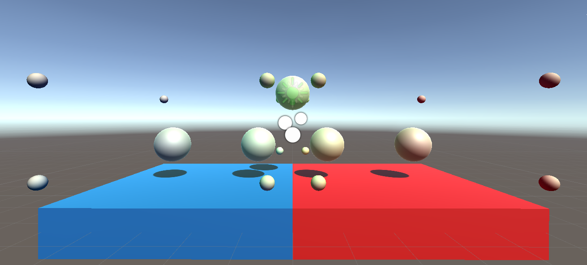

# ImportLightProbes
Unity version: 2020.3

This sample shows how to import externally-generated (e.g. in Blender) lightprobes in a scene in the Editor.

In its initial state, the "ImporterScene" scene has 8 light probes and no GameObjects contribute to the Global Illumination (i.e. light probes). 5 spheres were added to visualize the light probes.

`probes.txt` contains the light probe positions and [spherical harmonics](https://docs.unity3d.com/Documentation/Manual/LightProbes-TechnicalInformation.html) in a csv format. These coefficients were generated with the GameObjects under `Environment` set to "Contribute Global Illumination" and the `External Bake Light` enabled.

To trigger the import process first load the "ImporterScene" scene and then use the "Light Probes" menu in the editor.
- "Import light probes" imports light probe positions and SH coefficients.
- "... [n]" does step n of "Import light probes". For debugging.
- "Log light probe data" outputs to the console the current light probe data.
- "Reset light probes" reverts to the default light probe setup.
- "Clear baked data" clears the baked lighting data.

Switch between the "ImporterScene" and "EmptyScene" scenes to validate that the import worked.

Note that it's best to set the [Lightmapping settings](https://docs.unity3d.com/Manual/Lightmapping.html) to their lowest values to make the "dummy" light baking step faster.

## Caveats
- Don't import with an additive scene loaded. This is because Unity creates a "merged" `LightProbes` object in that case which can interfere with the light probe data's serialization to disk.
- Importing positions is straighforward through `LightProbeGroup.probePositions`. Serializing (i.e. saving to disk) the imported coefficients is not as direct and we need to make sure to save `LightmapSettings.lightProbes`.
- As this is not directly supported (at the moment) by Unity, please add some tests to validate the light probes are correctly imported and saved in your use case.

## Results

Initial state:

Positions imported and "dummy" bake done with light probe preview active:

Final result with light probe preview active:

